# Face Detection and Recognition of The Flintstones characters

This project implements a system for detecting and recognizing characters' faces from *"The Flintstones"* animated series using computer vision techniques.

## Objectives

The project focuses on two main tasks:

1. **Facial Detection**: detect all faces in the images
2. **Facial Recognition**: recognize the faces of the four main characters (Fred, Barney, Betty and Wilma)

## Data

The dataset, located in the [`data`](data) folder, is divided into training, validation and testing. In the training set, each of the four main characters (Fred, Barney, Betty and Wilma) has its own folder containing 1000 images, accompanied by a corresponding annotation file. Each line in the annotation file includes the image name, the bounding box coordinates of a detected face and the recognized character.

- **Training Set**: 4000 images (1000 per character)
- **Validation Set**: 200 images
- **Test Set**: 200 images

## Positive and Negative Examples for Training

The first step in solving the detection task involved identifying positive and negative examples for training the classifier to distinguish between faces and non-faces. To select these examples, I used the data available in the [`data/antrenare`](data/antrenare) directory.

### Color Filters

To improve the face detection process and extract the examples used during training, I applied a strategy based on **color filters**. This approach aims to isolate regions in an image that contain skin tones or shades close to skin color. This way, the area of interest (faces) is significantly reduced. In the algorithm, I implemented two color filters based on different approaches. 

The first filter is applied in the **HSV** (Hue, Saturation, Value) space, with ranges of [0, 20] for hue, [20, 255] for saturation and [70, 255] for brightness, to emphasize regions in the original image with skin-like tones, specifically red, orange, and yellow. By targeting pixels with moderate to high saturation and brightness, this filter effectively adapts to various lighting conditions.

  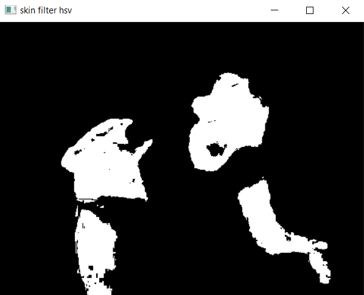
  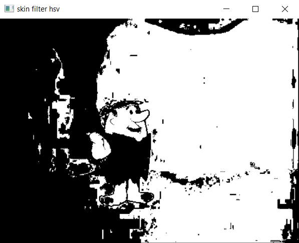

  <i>Regions extracted by applying the filter over the HSV space</i>

The second filter is based on various studies on skin detection in images and employs both the RGB and HSV color spaces. Initially, the color channels (blue, green, red) are extracted to analyze their distribution, adapting skin region detection criteria for different lighting conditions based on insights from this article [this article](https://medium.com/swlh/human-skin-color-classification-using-the-threshold-classifier-rgb-ycbcr-hsv-python-code-d34d51febdf8). Thresholds were adjusted to align more closely with the training and validation images. In the second stage, a mask is defined in the HSV space, retaining pixels with a hue value below 50 or above 150.

  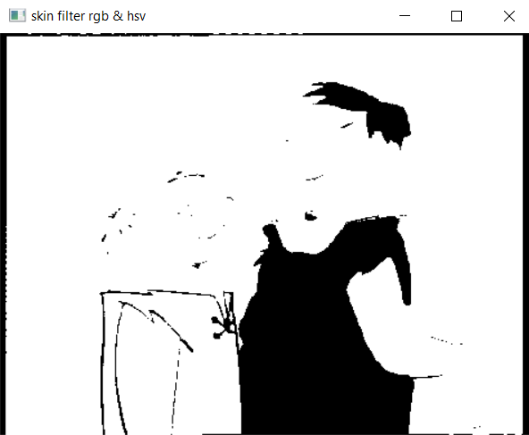
  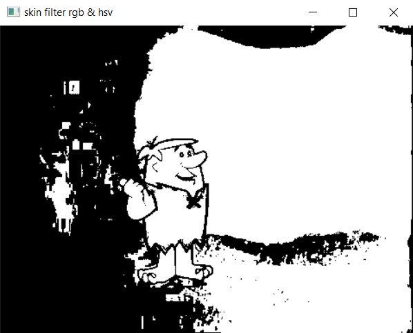

  <i>Regions extracted by applying the filter over the RGB and HSV spaces</i>

Since the first filter was sensitive to lighting variations, many faces in darker images were not detected. As shown in the images above, where both filters were applied to the same images, the second filter is more permissive than the first. This is why I use the second filter in the detection stage.

### Positive Examples

The set of positive examples includes **6920** images of size **64x64** that contain faces. The extraction process was done using the script [`getPositiveExamples.py`](Cod_Sursa_Rincu_Stefania_332/getPositiveExamples.py), where I used the four `.txt` annotation  files to extract all the bounding boxes containing faces from each image.

To **label** each character from the positive examples and simplify the recognition task later, I introduced a digit-based encoding system:
- **Barney - 0**
- **Betty - 1**
- **Fred - 2**
- **Wilma - 3**
- **Unknown - 4** (faces that do not correspond to one of the four main characters)

  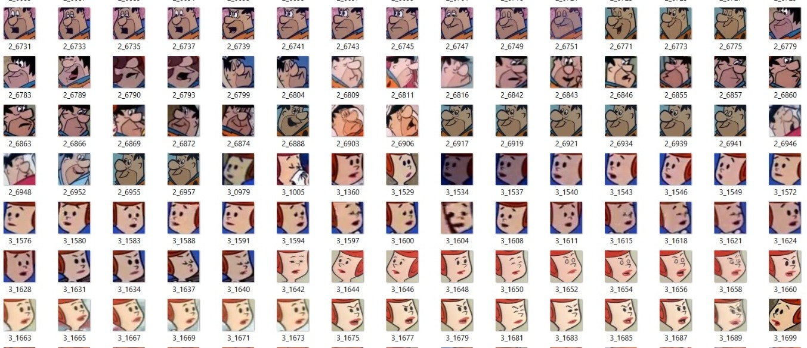

Before saving the positive examples, I applied the second color filter mentioned earlier to ensure the dataset retained specific properties. This filtering process eliminated some faces belonging to unknown characters. Additionally, I manualy removed several blurred face images to further refine the dataset. 

The positive examples are located in the [`positiveExamples64`](data/antrenare/positiveExamples64) folder.

### Negative Examples

The set of negative examples was formed of **207906** images of size **64x64** that do not contain faces. The extraction process was done using the script [`getNegativeExamples.py`](Cod_Sursa_Rincu_Stefania_332/getNegativeExamples.py), by randomly selecting regions from the training images. 

I **scaled** each image from the [`data/antrenare`](data/antrenare) directory to create a diverse dataset. For each scale, I randomly selected up to **40** negative examples. To ensure that the selected regions contained skin-like colors, I applied the first, more restrictive color filter described above. If the average value of the extracted patch after applying this filter exceeded a certain threshold, I checked if the patch **did not overlap with any detected faces** in the image and that its overlap with already extracted negative examples was minimal.

Due to the huge amount of negative examples I used,I did not include the folder containing all of them in the project.

## Determining Positive Feature Vectors

In the `get_positive_descriptors` method, implemented in both [`FacialDetector.py`](Cod_Sursa_Rincu_Stefania_332/FacialDetector.py) and [`FacialRecognition.py`](Cod_Sursa_Rincu_Stefania_332/FacialRecognition.py), I generated the positive descriptors necessary for training classifiers specialized in facial detection and recognition. To expand the set of positive examples, in addition to **mirroring** the images (horizontal flip, which was used in the lab), I introduced two additional augmentation techniques: **rotation** and **translation** of the face images.

In the final approach, I kept only **translations up, down, left, and right**, excluding diagonal movements. For each augmented image, I applied the **Histogram of Oriented Gradients (HOG)** algorithm to extract the relevant features.

  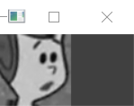
  &nbsp;&nbsp;&nbsp;&nbsp;&nbsp;&nbsp;&nbsp;&nbsp;&nbsp;&nbsp;&nbsp;&nbsp;&nbsp;&nbsp;&nbsp;&nbsp;&nbsp;&nbsp;
  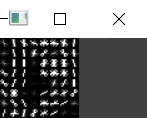

  <i>Visualization of the HOG descriptors associated with a certain image</i>

## Determining Negative Feature Vectors

In the `get_negative_descriptors` method, implemented in [`FacialDetector.py`](Cod_Sursa_Rincu_Stefania_332/FacialDetector.py), I extracted the negative examples from the specified directory and computed their corresponding HOG descriptors. Unlike the positive examples, I did not apply any augmentation techniques to the negative examples.

## Multi-scale Paradigm

To address the variability in distance from the *camera* (foreground) and to handle cases with faces that are either closer or farther away, I defined a scaling vector with values between **1.5** and **0.4**, which was used to resize the original image. Using this approach, I created a pyramid of resized images, as illustrated in the image below. This technique improved the classifier’s ability to detect faces in various conditions and distances.

  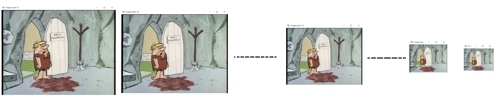

## Sliding Window

To implement the **sliding window** approach for face detection in this project, I used a technique that progressively selects sections of the image with a **64x64** window size. To optimize the shape and size of the bounding boxes used for character faces detection, I calculated the **average height, width and aspect ratio** for all the faces extracted as positive examples. Based on this analysis, I added a scaling vector to resize the original image horizontally or vertically, which allowed me to simulate **rectangular bounding boxes** for better accuracy.

  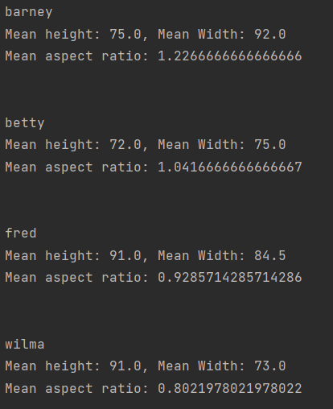

## Face Detection Procedure

### Step 1: Retrieving the Dataset Used for Model Training

To train the detection classifier, I used the HOG feature vectors extracted as described in the sections [Determining Positive Feature Vectors](#determining-positive-feature-vectors) and [Determining Negative Feature Vectors](#determining-negative-feature-vectors).

### Step 2: Training the Classifier

To solve the detection task, I used an **MLPClassifier (Multi-Layer Perceptron Classifier)**, imported from the `sklearn.neural_network` library. I selected **ReLU (Rectified Linear Unit)** as the activation function, as it speeds up learning by removing negative values. As a solver, I chose **Adam** to adjust the weights. From previous experience, I knew that a constant learning rate does not favor the model’s learning, so I set it to **adaptive**. The training runs for a maximum of **1500** epochs, with early stopping if no improvement is seen after **5** consecutive epochs. The best model for detection is saved in the file [`mlp_detection_207906_207600.npy`](saved_files/models/mlp_detection_207906_207600.npy).

### Step 3: Face Detection

In the `run_detection` method, found in the [`FacialDetector.py`](Cod_Sursa_Rincu_Stefania_332/FacialDetector.py) script, I analyze each test image one by one. The detection process is based on the **multi-scale sliding window** paradigm mentioned earlier. Each image is resized both horizontally and vertically, in order to create a pyramid of images. To detect rectangular windows as well, I also slightly adjust the heights or widths separately (see sections [Multi-scale Paradigm](#multi-scale-paradigm) and [Sliding Window](#sliding-window)).

Next, I calculate the HOG descriptors for each region of the image and also extract the color image patch. Then, I apply the two color filters I mentioned before, in order to select only the regions that contain skin tones.

As a **confidence score**, the MLP classifier returns the logarithms of the predicted probabilities for each class, which are values between 0 and 1. These scores are returned as **negative values** (logarithmic). To decide whether a patch is a face or not, I use this confidence score and choose the class with the highest score. To reduce false positives, I also added a threshold for the score.

Finally, the function returns the coordinates of the detected faces (bounding boxes), the associated scores, and the names of the corresponding test image files.

## Face Recognition Procedure

### Step 1: Retrieving the Dataset used for Model Training

The first step is similar to the one presented in section above. In addition, I added the `get_training_examples_each_character` method, which is part of the [`FacialRecognition.py`](Cod_Sursa_Rincu_Stefania_332/FacialRecognition.py) script. This function retrieves the datasets needed to train the classifiers for each character (Fred, Barney, Betty, and Wilma) individually.

To determine the best distribution of the training data, I looked for the situations where characters were most frequently **confused** with one another. I noticed that Barney is often mistaken for Fred and Betty with Wilma. In order to improve the accuracy of the models, I **adjusted the proportions** of the datasets used for training each classifier. So I allocated more positive and negative examples to the characters that caused **significant confusions**. Additionally, I shuffled the feature vectors in each step to avoid using the same features in the same order every time.

### Step 2: Training the Classifiers

To solve the recognition task, I decided to use a separate model for each character. In the `train_mlp_recognition_each` method from the [`FacialRecognition.py`](Cod_Sursa_Rincu_Stefania_332/FacialRecognition.py) script, I set up a **MLP (Multi-Layer Perceptron Classifier)** model, which is trained using the dataset for each character individually.

The parameters for each model are almost the same as those I used in the detection task, as explained earlier. The only parameter that is different is the number of maximum iterations. After training, I save each model with a name that indicates the character it was trained to recognize. The file names follow the format `mlp_recognition_` plus the character's label, which I mentioned in the section [Positive Examples](#positive-examples).

### Step 3: Face Recognition

In the `run_recognition` method, found in the [`FacialRecognition.py`](Cod_Sursa_Rincu_Stefania_332/FacialRecognition.py) script, the recognition process uses the descriptors obtained from the previous face detection step. These descriptors are passed to each of the four specialized classifiers to identify which main character (Barney, Betty, Fred and Wilma) they belong to.

Using the scores (probabilities) returned by each classifier, I implemented a **weighted voting system**. This determines which character has the highest confidence score, taking multiple results into account. If all four models classify a descriptor as class 0, it means that the face is either unknown or part of the background.

The final results are organized and stored separately for each character.

## Results

After running the trained models on the test dataset, the obtained performances are:

  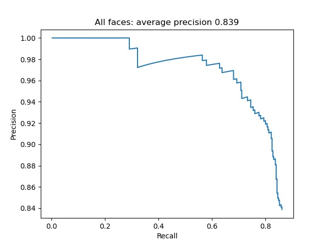

  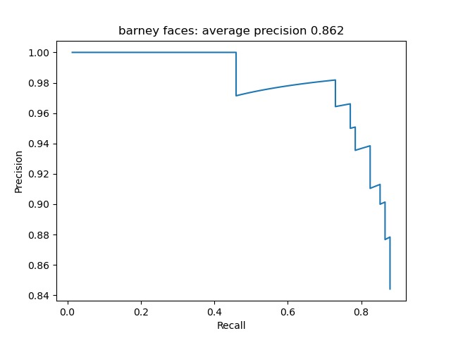
  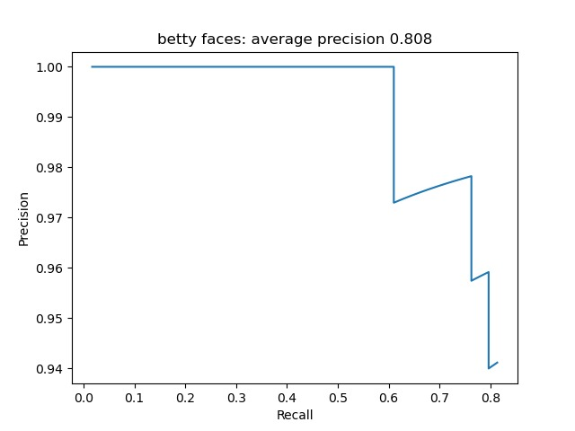
    
  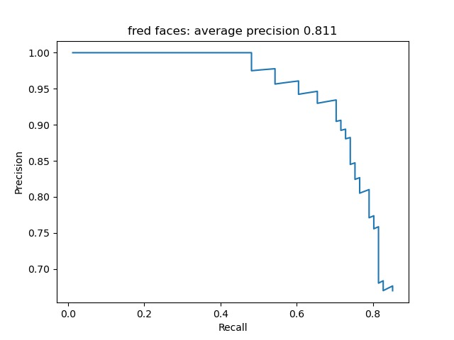
  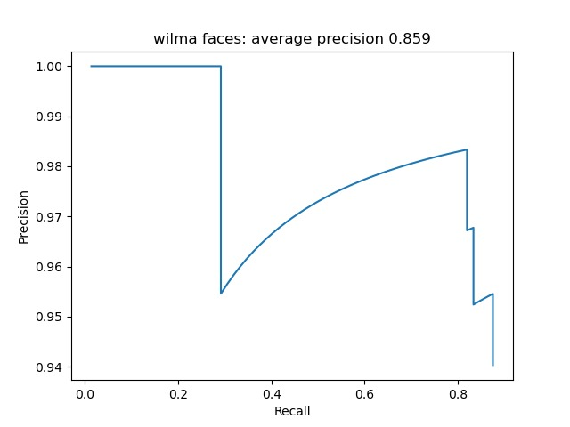

## How to run
**NOTE:** The algorithm is quite slow. It takes between 4 and 5 hours to perform detection and recognition on the 200 test images.

To install all required libraries, you can find the Anaconda environment file in `fdr.yaml`. Simply download it, import it into Anaconda, and select it as the interpreter when running the project. 

Alternatively, if you don't want to use Anaconda, you will need to manually install **numpy**, **scikit-learn**, **scikit-image**, **matplotlib** and **opencv**.

Both Task 1 and Task 2 are run based on the same script: [`RunProject.py`](Cod_Sursa_Rincu_Stefania_332/RunProject.py).

If you want to create and train new models, make sure that you have generated the positive and negative examples. Also, set the following parameters to **True**: `params.training`, `params.training_detection` and `params.training_recognition` (lines 26, 27 and 28 in `RunProject.py`). If you want to test the models on validation or test datasets, you can set `params.training` to **False**. To train only the detection or only the recognition models, adjust `params.training_detection` and `params.training_recognition` accordingly.

### Project Structure
I used the project structure implemented during the lab as a template. Inside the folder [`Cod_Sursa_Rincu_Stefania_332`](Cod_Sursa_Rincu_Stefania_332), I included the following scripts:
- [`Parameters.py`](Cod_Sursa_Rincu_Stefania_332/Parameters.py) -> contains the paths to the used directories.
- [`RunProject.py`](Cod_Sursa_Rincu_Stefania_332/RunProject.py) -> the equivalent of main.py, through which the entire project is executed.
- [`FacialDetector.py`](Cod_Sursa_Rincu_Stefania_332/FacialDetector.py) -> contains the implementation of the method used for face detection.
- [`FacialRecognition.py`](Cod_Sursa_Rincu_Stefania_332/FacialRecognition.py) -> contains the implementation of the method used for face recognition.
- [`getNegativeExamples.py`](Cod_Sursa_Rincu_Stefania_332/getNegativeExamples.py) -> script in which I performed the extraction of negative examples (run it individually if you want to generate negative examples).
- [`getPositiveExamples.py`](Cod_Sursa_Rincu_Stefania_332/getPositiveExamples.py) -> script in which I performed the extraction of positive examples (run it individually if you want to generate positive examples).

### Saved Files
In the `Parameters.py` script, I declared the paths to the directories where the necessary data is saved and from where it should be extracted. The models are saved in the [`saved_files/models`](saved_files/models) directory, which is uploaded together with the rest of the project. This folder should be opened. The classifiers are:
- `mlp_detection_207906_207600.npy` - for detection
- `mlp_recognition_0.npy`- recognition for Barney
- `mlp_recognition_1.npy` - recognition for Betty
- `mlp_recognition_2.npy` - recognition for Fred
- `mlp_recognition_3.npy` - recognition for Wilma

To retrieve the models and test their performance, the following paths from `Parameters.py` are used:
- **self.base_dir** (line 6 - must be completed with the path to the base directory where the data is saved)
- **self.dir_test_examples** (line 11 - comment it out and uncomment line 12 if you want to run for validation)
- **self.path_annotations** (line 13 - comment it out and uncomment line 14 if you want to run for validation)
- **self.dir_save_files** (line 17 - should not be modified; it contains the name of the directory where the models are saved)
- **self.dir_save_training_descriptors** (line 18 - should not be modified; it contains the name of the directory where the descriptors used for training are saved. I did not include this folder in the project due to the large number of positive and negative examples used, which exceeded the size limit accepted by GitHub)
- **self.dir_save_models** (line 19 - should not be modified; it contains the name of the directory where the models used for detection and recognition are saved)

In the `Parameters.py` script, I declared the paths to the directories where I save the **.npy** files containing the detections, scores, and names of the images. The directories [`evaluare/fisiere_solutie/332_Rincu_Stefania/task1_test`](evaluare/fisiere_solutie/332_Rincu_Stefania/task1_test) and [`evaluare/fisiere_solutie/332_Rincu_Stefania/task2_test`](evaluare/fisiere_solutie/332_Rincu_Stefania/task2_test) are created automatically. These should appear in the editor where the project is run.  

To save the results in **.npy** files, the following paths from `Parameters.py` are used:
- **self.dir_sol_task1_folder** (line 20 - comment it out and uncomment line 23 if you want to run for validation)
- **self.dir_sol_task2_folder** (line 21 - comment it out and uncomment line 24 if you want to run for validation)

To test the performances of the model, there is a script named `evalueaza_solutie.py` located in the [`evaluare/cod_evaluare`](evaluare/cod_evaluare) folder. This script compares the results presented in [`evaluare/fisiere_solutie/332_Rincu_Stefania`](evaluare/fisiere_solutie/332_Rincu_Stefania) with the ground truth provided with the datasets. For the test dataset, the ground truth files can be found in [`data/testare/ground-truth-test`](data/testare/ground-truth-test) and for validation in [`data/validare/ground-truth-validare`](data/validare/ground-truth-validare). These paths can be modified at lines 174 and 175 in `evalueaza_solutie.py`.